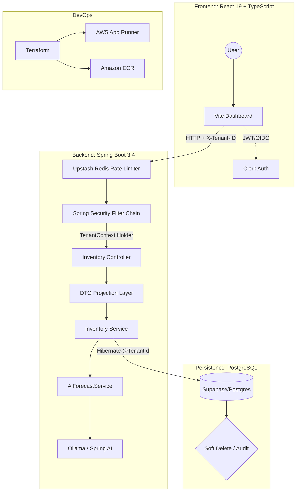

# stack-inventory-manager

A multi-tenant SaaS platform for real-time inventory management built with a focus on **data isolation, concurrency safety, and subscription-aware backend enforcement**.

The system addresses a common B2B SaaS challenge: multiple organizations sharing infrastructure without ever sharing data, while supporting high write throughput, operational correctness, and feature-tier differentiation.

## 🏗️ System Architecture



## 🛠️ Technical Specifications

### Backend (saas-manager)
* **Runtime:** Java 21 (Amazon Corretto) utilizing **Virtual Threads** for high-throughput I/O.
* **Multi-tenancy:** Shared-database, shared-schema approach using **Hibernate 7 `@TenantId`**. Tenant resolution is handled via a custom `CurrentTenantIdentifierResolver` linked to the `X-Tenant-ID` header.
* **Rate Limiting:** Distributed bucket-fill strategy using **Bucket4j + Upstash Redis**, enforcing tiered limits based on tenant subscription levels.
* **Usage Tracking:** Real-time usage reporting via **Redis**. The backend injects X-Usage-SKU and X-Usage-AI headers into every response, allowing the frontend to update progress bars without additional API calls.
* **Persistence:** PostgreSQL (Supabase) with **Hibernate Soft Delete** for lifecycle management.
* **Security:** Stateless JWT validation with **Clerk**; Method-level RBAC (`@PreAuthorize`).
* **Reporting:** Low-overhead PDF generation via **OpenPDF**, avoiding the resource cost of headless browser rendering.

### Frontend (frontend)
* **Framework:** React 19 (Concurrent Mode) + Vite.
* **State Management:** React Query for server-state synchronization and optimistic UI updates.
* **Auth/Billing:** Clerk-integrated middleware for organization-switching and Stripe-gated API access.

### Infrastructure
* **Provider:** AWS (Region: `ap-southeast-1`).
* **Deployment:** Containerized via **multi-stage Docker builds** (distroless-style) and deployed on **AWS App Runner**.
* **IaC:** Terraform modules for VPC-less App Runner configuration and ECR lifecycle policies.

## 🚀 Engineering Highlights

### 1. Robust Data Isolation
Unlike standard "Where" clause filtering, this system implements **Hibernate 7 Tenant Filtering** at the session level. Every database interaction is natively scoped to a `tenant_id` via the `TenantContext`, mitigating the risk of Cross-Tenant Data Leaks—a critical requirement for B2B SaaS compliance.

### 2. High-Performance AI Caching (Caffeine)
To mitigate the latency and cost of LLM inference, the system utilizes a **Reactive Eviction Cache** powered by Caffeine. 
* **Write-Through Invalidation:** The cache is intelligently evicted only when relevant stock-altering transactions occur, ensuring AI insights never drift from live inventory levels.
* **Tenant Isolation:** Cache keys are dynamically scoped using SpEL to ensure zero data-leakage between organizations.
* **Latency Reduction:** Reduces Dashboard load times for analytical views from >3s (LLM cold start) to <50ms (Cache hit).

### 3. Live Usage Sync (Header-based)
To minimize API overhead, the system uses a **"Piggyback" usage sync pattern**. Instead of polling for usage stats, the backend computes current consumption (SKUs used vs. limit, AI tokens used vs. budget) and attaches this data to the response headers of standard CRUD operations.
* **Zero-Latency Updates:** The frontend UI (progress bars, limit warnings) updates automatically after any data interaction without extra network round-trips.
* **Backend Enforcement:** Usage is validated by the `BillingGuard` interceptor before the response is finalized.

### 4. Predictive "Days-Until-Out" Analysis
Forecasting uses a hybrid deterministic + grounded LLM analytics approach.
- **Deterministic Core:** Consumption velocity is calculated using rolling windows and linear regression to predict estimated depletion dates.
- **Grounded LLM Layer:** Structured inventory data and computed metrics are assembled at runtime and injected into the LLM prompt. This differs from RAG as it relies on live transactional data rather than vector embeddings.
- **Safety Model:** Alerts and reorder thresholds remain rule-based to prevent non-deterministic AI output from affecting operational correctness.

### 5. Tiered Distributed Rate Limiting & Gating
To protect the system from resource exhaustion, we utilize a **Redis-backed distributed rate limiter** and **Subscription Gating**:
* **Tenant-Aware Limits:** Quotas are dynamically applied via **Bucket4j** based on the tenant's subscription plan.
* **Feature Gating:** High-compute tasks (AI forecasting, PDF generation) are intercepted by a `SubscriptionGuard` that validates the organization's Stripe status via Clerk metadata before execution.

## 🧠 AI Architecture Approach

The AI system follows a **Structured Context Grounding** pattern:

1. Application queries relevant inventory items and transaction history
2. Metrics (velocity, trends, depletion estimates) are computed deterministically
3. Structured context is assembled and injected into the LLM prompt
4. The LLM produces analysis, explanations, and recommendations

This differs from traditional RAG systems, which rely on vector databases and semantic retrieval. Here, the context source of truth is the live transactional database, ensuring responses remain aligned with real operational data.


## ⚖️ Engineering Tradeoffs

| Decision | Benefit | Cost / Limitation |
| :--- | :--- | :--- |
| **Shared-schema Multi-tenancy** | Simplifies database migrations and scaling; significantly lower operational overhead than siloed databases. | Requires rigorous session-level filtering (Hibernate `@TenantId`) and strategic indexing on `tenant_id` to maintain performance. |
| **In-Memory Caching (Caffeine)** | Drastic reduction in LLM API costs and UI latency (sub-50ms hits). Provides a snappier user experience. | Increases JVM Heap memory usage; requires complex manual eviction hooks to ensure data consistency across the app. |
| **Grounded AI over RAG** | Ensures 100% accuracy relative to live transactional data; avoids "hallucinations" common in outdated vector embeddings. | Limited by the LLM's context window size; lacks the ability to "search" through massive external document stores. |
| **Header-based Usage Sync** | Zero-latency UI updates without dedicated polling endpoints or the overhead of WebSocket management. | Slightly increases response header size; requires frontend logic to intercept and parse headers on every API call. |
| **Redis-backed Rate Limiting** | Ensures global limit consistency across horizontally scaled backend instances. | Introduces an external infrastructure dependency (Redis/Upstash) and a small network hop for every request. |

## 🚀 Deployment & Infrastructure

The platform follows a modern **Infrastructure as Code (IaC)** and containerization workflow, specifically optimized for high-performance delivery in the `ap-southeast-1` (Singapore) region.

### 1. Infrastructure as Code (Terraform)
All AWS resources are provisioned via Terraform to ensure environment parity and security:
* **ECR Repositories:** Private registries for `saas-backend` and `saas-frontend` with `force_delete` enabled for agile lifecycle management.
* **IAM Least Privilege:** * `apprunner-ecr-access-role`: Dedicated role for image pulling during deployment.
    * `apprunner-instance-role`: Runtime role granting `bedrock:InvokeModel` permissions, enabling secure AI forecasting without managing AWS Access Keys.
* **App Runner:** Configured with `1024 CPU` and `2048 Memory` units to handle the resource demands of the Spring Boot runtime and Virtual Thread scheduling.

### 2. Containerization Strategy
Both the frontend and backend utilize **Multi-stage Docker builds**:
* **Backend:** Leverages a Build stage (Maven) and a Runtime stage (Amazon Corretto 21) to keep production images lean and secure.
* **Frontend:** Uses a Node build environment followed by an Nginx runtime stage to serve static assets with optimized header configurations.

### 3. Automated Deployment Workflow
Deployment is orchestrated via the `deploy.sh` script, which automates the transition from local code to cloud execution:

```bash
# 1. Build & Package
./mvnw clean package -DskipTests

# 2. Authenticate & Push
aws ecr get-login-password --region ap-southeast-1 | docker login --username AWS --password-stdin [AWS_ACCOUNT_ID].dkr.ecr.ap-southeast-1.amazonaws.com

# 3. Build & Push Images
docker build -t saas-backend ./saas-manager
docker push [AWS_ACCOUNT_ID][.dkr.ecr.ap-southeast-1.amazonaws.com/saas-backend:latest](https://.dkr.ecr.ap-southeast-1.amazonaws.com/saas-backend:latest)
```

### 4. Environment Variables & Secrets
Security is maintained by injecting sensitive configurations directly into the App Runner service environment:
* **Database:** `DB_URL`, `DB_USERNAME`, `DB_PASSWORD` (Supabase).
* **Auth:** `CLERK_ISSUER_URI`, `CLERK_SECRET_KEY`.
* **Cache:** `REDIS_HOST`, `REDIS_PORT`, `REDIS_PASSWORD`.
* **AI Region:** `SPRING_AI_BEDROCK_AWS_REGION` explicitly set to `ap-southeast-1`.

---

### 🛠️ Local Setup
To run the stack locally:
1. Ensure **Docker Desktop** is running.
2. Run `docker-compose up -d` to start local **PostgreSQL** and **Redis** instances.
3. Use the `dev` Spring profile to connect to local dependencies.
