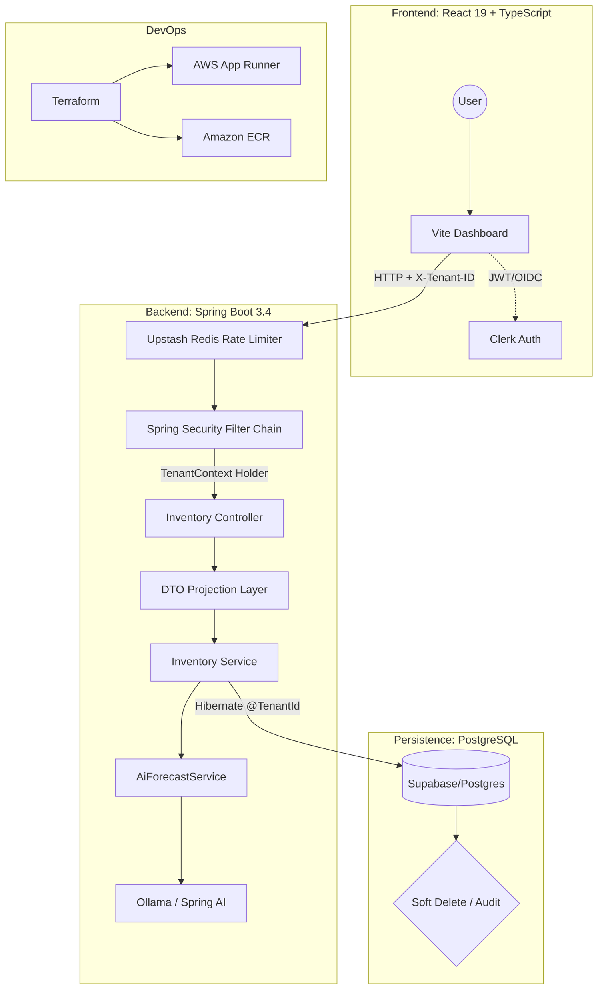

# stack-inventory-manager

A multi-tenant SaaS platform for real-time inventory management built with a focus on **data isolation, concurrency safety, and subscription-aware backend enforcement**.

The system addresses a common B2B SaaS challenge: multiple organizations sharing infrastructure without ever sharing data, while supporting high write throughput, operational correctness, and feature-tier differentiation.

## 🏗️ System Architecture

## 🛠️ Technical Specifications

### Backend (saas-manager)
* **Runtime:** Java 21 (Amazon Corretto) utilizing **Virtual Threads** for high-throughput I/O.
* **Multi-tenancy:** Shared-database, shared-schema approach using **Hibernate 7 `@TenantId`**. Tenant resolution is handled via a custom `CurrentTenantIdentifierResolver` linked to the `X-Tenant-ID` header.
* **Rate Limiting:** Distributed bucket-fill strategy using **Bucket4j + Upstash Redis**, enforcing tiered limits based on tenant subscription levels.
* **Usage Tracking:** Real-time usage reporting via **Redis**. The backend injects X-Usage-SKU and X-Usage-AI headers into every response, allowing the frontend to update progress bars without additional API calls.
* **Persistence:** PostgreSQL (Supabase) with **Hibernate Soft Delete** for lifecycle management.
* **Security:** Stateless JWT validation with **Clerk**; Method-level RBAC (`@PreAuthorize`).
* **Reporting:** Low-overhead PDF generation via **OpenPDF**, avoiding the resource cost of headless browser rendering.

### Frontend (frontend)
* **Framework:** React 19 (Concurrent Mode) + Vite.
* **State Management:** React Query for server-state synchronization and optimistic UI updates.
* **Auth/Billing:** Clerk-integrated middleware for organization-switching and Stripe-gated API access.

### Infrastructure
* **Provider:** AWS (Region: `ap-southeast-1`).
* **Deployment:** Containerized via **multi-stage Docker builds** (distroless-style) and deployed on **AWS App Runner**.
* **IaC:** Terraform modules for VPC-less App Runner configuration and ECR lifecycle policies.

## 🚀 Engineering Highlights

### 1. Robust Data Isolation
Unlike standard "Where" clause filtering, this system implements **Hibernate 7 Tenant Filtering** at the session level. Every database interaction is natively scoped to a `tenant_id`, mitigating the risk of Cross-Tenant Data Leaks—a critical requirement for B2B SaaS compliance.

### 2. Live Usage Sync (Header-based)
To minimize API overhead, the system uses a **"Piggyback" usage sync pattern**. Instead of polling for usage stats, the backend computes current consumption (SKUs used vs. limit, AI tokens used vs. budget) and attaches this data to the response headers of standard CRUD operations.

* **Zero-Latency Updates:** The frontend UI (progress bars, limit warnings) updates automatically after any data interaction.
* **Reduced Complexity:** Eliminates the need for dedicated `/usage` polling endpoints or WebSocket overhead.
* **Backend Enforcement:** Usage is validated by the `BillingGuard` before the response is finalized.

### 3. Predictive "Days-Until-Out" Analysis

Forecasting uses a hybrid deterministic + grounded LLM analytics approach.

- **Deterministic Core:** Consumption velocity is calculated using rolling 7-day and 30-day windows. A linear regression model predicts the estimated depletion date based on historical stock-out trends.
- **Grounded LLM Layer:** Structured inventory data, recent transactions, and computed metrics are assembled at runtime and injected into the LLM prompt for contextual analysis and human-readable insight generation.
- **Not RAG:** The system does not use embedding-based document retrieval. Instead, it relies on deterministic database queries to provide real-time operational context.
- **Safety Model:** Alerts and reorder thresholds remain rule-based to prevent non-deterministic AI output from affecting operational correctness.
- **Cost Control:** Forecasting operations are batched per tenant to avoid per-request LLM overhead.

This ensures forecasting remains explainable, context-aware, and operationally safe.

### 4. Tiered Distributed Rate Limiting
To protect the system from resource exhaustion and manage AI costs, we utilize a **Redis-backed distributed rate limiter**:
* **Tenant-Aware Limits:** Quotas are dynamically applied based on the `X-Organization-Plan` header.
* **Resiliency:** Implemented via **Bucket4j**, the system provides a graceful `429 Too Many Requests` response, ensuring platform stability during traffic spikes or "noisy neighbor" scenarios.

### 5. Subscription-Aware Feature Gating
The backend doesn't just check roles; it checks **Tenant Plan Metadata**. High-compute tasks (like AI forecasting and PDF batch processing) are intercepted by a `SubscriptionGuard` that validates the organization's Stripe status via Clerk metadata before execution.

## 🧠 AI Architecture Approach

The AI system follows a **Structured Context Grounding** pattern:

1. Application queries relevant inventory items and transaction history
2. Metrics (velocity, trends, depletion estimates) are computed deterministically
3. Structured context is assembled and injected into the LLM prompt
4. The LLM produces analysis, explanations, and recommendations

This differs from traditional RAG systems, which rely on vector databases and semantic retrieval. Here, the context source of truth is the live transactional database, ensuring responses remain aligned with real operational data.

## ⚖️ Engineering Tradeoffs

| Decision | Benefit | Cost / Limitation |
|----------|---------|-------------------|
| Shared-schema multi-tenancy | Simplified scaling and migrations | Requires careful per-tenant indexing |
| Redis-backed Rate Limiting | Global limit consistency across instances | Introduces external dependency on Redis |
| Virtual Threads | Significant throughput boost for blocking I/O | Requires Java 21+; complicates thread-local debugging |
| Grounded AI over RAG | 100% accuracy relative to live transactional data | Limited by LLM context window sizes |
| Soft delete strategy | Preserves historical audit integrity | Requires explicit filter control in reporting queries |

