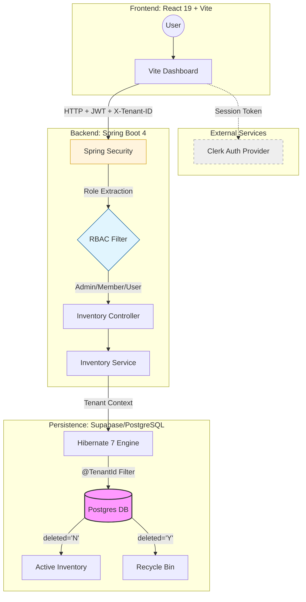
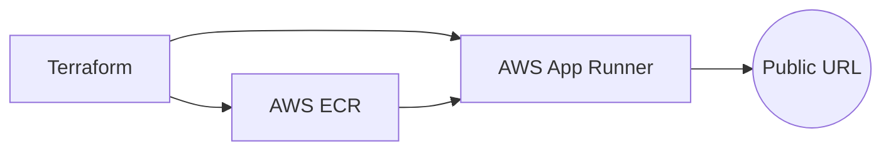

# 📦 stack-inventory-manager

An enterprise-grade, **Multi-tenant SaaS** platform for real-time inventory tracking. Architected with a high-performance **Spring Boot** reactive core, a type-safe **React 19** frontend, and a **fully-automated AWS ecosystem** provisioned through **Terraform**.

> **Key Pillar:** Secure data isolation using Hibernate `@TenantId`, granular RBAC, and **Immutable Infrastructure** via Terraform to ensure cost-optimized, reproducible cloud deployments.

---

## System Architecture



## 🚀 Tech Stack

### Frontend
* **Framework:** React 19+ (Vite)
* **Language:** TypeScript
* **Styling:** Tailwind CSS
* **Auth:** Clerk (Identity & User Management)

### Backend (`saas-manager`)
* **Framework:** Spring Boot 4
* **Language:** Java 21 (Amazon Corretto)
* **ORM:** Hibernate 7 (Native `@SoftDelete` & `@TenantId` support)
* **Database:** Supabase (PostgreSQL)
* **Security:** Spring Security + Method-level RBAC (`@PreAuthorize`)

### Infrastructure & DevOps
* **Cloud:** AWS (Region: `ap-southeast-1`)
* **Compute:** AWS App Runner
* **IaC:** Terraform
* **Containerization:** Docker (Multi-stage builds)

## Key Features

- **Multi-tenant Isolation:** Automatic data filtering via Hibernate `@TenantId` and the `X-Tenant-ID` header, ensuring users never see data from other organizations.
- **Granular RBAC:** Role-Based Access Control protecting endpoints for `ADMIN`, `MEMBER`, and `USER` roles.
- **Audit-Ready Soft Delete:** Items marked for deletion move to a "Recycle Bin" instead of being erased, maintaining a `deletedBy` audit trail.
- **Stock Movement History:** Automated logging of every `STOCK_IN` and `STOCK_OUT` event with user attribution.
- **Strict DTO Pattern:** Total isolation between database entities and API responses for maximum security and flexibility.

## Deployment (AWS)

### 1. Build and Push to ECR
Ensure you are authenticated with AWS ECR, then run the build commands:

```bash
# Build & Push Backend
docker build -t saas-backend ./saas-manager
docker tag saas-backend:latest YOUR_ACCOUNT_ID.dkr.ecr.ap-southeast-1.amazonaws.com/saas-backend:latest
docker push YOUR_ACCOUNT_ID.dkr.ecr.ap-southeast-1.amazonaws.com/saas-backend:latest
```

```bash
# Build & Push Frontend
docker build -t saas-frontend ./frontend
docker tag saas-frontend:latest YOUR_ACCOUNT_ID.dkr.ecr.ap-southeast-1.amazonaws.com/saas-frontend:latest
docker push YOUR_ACCOUNT_ID.dkr.ecr.ap-southeast-1.amazonaws.com/saas-frontend:latest
```

## Why I Built This

I developed **stack-inventory-manager** to solve the complex architectural challenges inherent in modern SaaS environments. Most "to-do" or "inventory" tutorials skip the critical realities of production software—security, multi-tenancy, and data integrity. This project serves as a deep dive into:

### 1. The "SaaS First" Mentality
I wanted to move beyond a single-user application. By implementing **Multi-tenancy at the database level**, I tackled the challenge of data isolation. This ensures that the platform can scale to support thousands of independent organizations while maintaining strict "siloed" security.

### 2. High-Consistency Architecture
In inventory management, a single desync in stock levels can ruin a business operation. I built this using a **Transaction-first approach**, where every stock movement is backed by an audit trail. Using **Spring Boot 4 and Java 21**, I leveraged modern language features to ensure the backend is both type-safe and performant.

### 3. Cloud-Native Scalability
Building the app was only half the battle. I included **Terraform and Docker** configurations to demonstrate an understanding of the full software development lifecycle (SDLC)—from a local dev environment to a horizontally scalable **AWS App Runner** deployment.

### Deployment Flow


## Architectural Decisions (Cost & Efficiency)

Choosing the right stack wasn't just about performance; it was about **operational efficiency** and **minimizing overhead**. As a solo engineer, I selected services that offer the best balance between "Enterprise Power" and "Startup Budget."

| Service | Choice | Why? (Cost & Logic) |
| :--- | :--- | :--- |
| **Compute** | **AWS App Runner** | Chosen over EKS/ECS to eliminate the "idle cost" of managing clusters. It provides a managed Fargate environment that scales based on traffic, ensuring I only pay for what I use. |
| **Database** | **Supabase (PostgreSQL)** | Leverages a high-performance hosted Postgres instance with a generous free tier. This removed the high monthly cost of an AWS RDS instance while providing built-in connection pooling. |
| **Auth** | **Clerk** | Outsourcing Identity Management to Clerk saved weeks of development time on secure login, MFA, and session management, reducing "Time to Market" and security liability. |
| **Registry** | **Amazon ECR** | Keeping images within the AWS ecosystem (ap-southeast-1) reduces data transfer costs and ensures lightning-fast deployments to App Runner. |
| **IaC** | **Terraform** | Automating the setup with IaC prevents "Cloud Waste" (forgotten resources) and allows for a 1-click `terraform destroy` to wipe the environment when not in use. |

### 🛠️ The "Zero-Waste" Deployment Flow
By utilizing **Docker multi-stage builds**, the final production images are stripped of build-tools (like Maven/Node), resulting in tiny footprints. This reduces storage costs in ECR and speeds up deployment times on App Runner.
