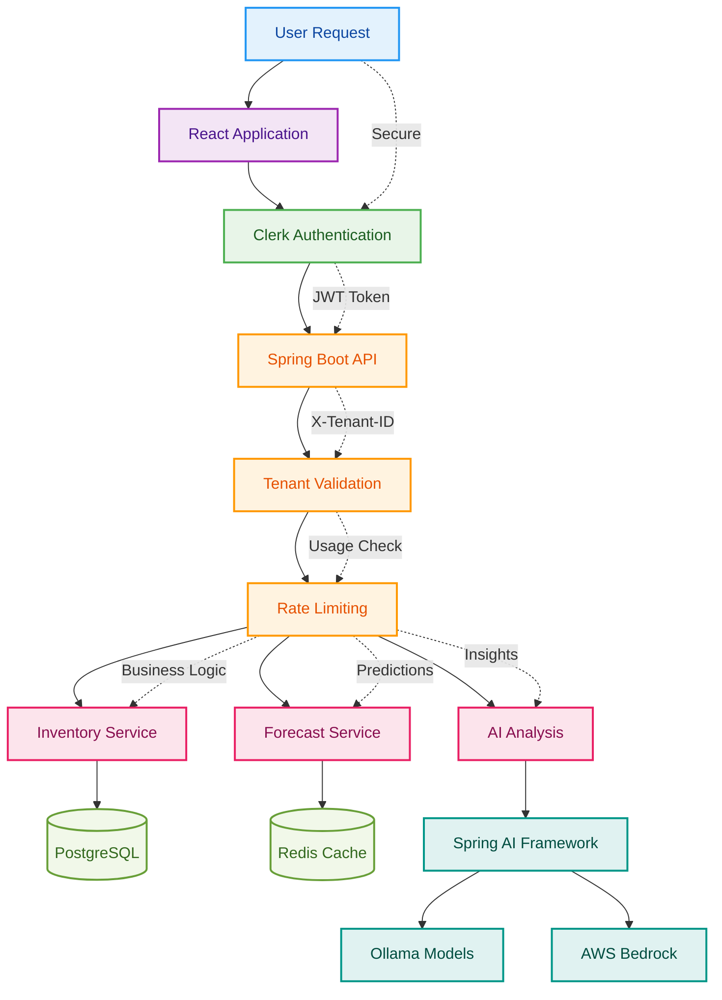

# SaaSManager

Enterprise-grade multi-tenant inventory management platform with AI-powered insights and real-time analytics.

A comprehensive B2B SaaS solution that provides complete data isolation, intelligent forecasting, and scalable infrastructure for modern inventory management needs.

## Features

### Core Inventory Management
- Multi-tenant architecture with complete data isolation
- Product catalog management with full CRUD operations
- Real-time stock level tracking and monitoring
- Intelligent low stock alerts and threshold management
- Comprehensive stock adjustments and movement tracking
- Activity logging and complete audit trails

### AI-Powered Intelligence
- Natural language inventory queries through intelligent chatbot
- AI-driven demand forecasting and predictive analytics
- Advanced stock velocity analysis and insights
- Automated inventory recommendations
- Intent-based query processing system

### Enterprise Security & Management
- Clerk-based authentication and authorization
- Role-based access control (Admin, Member, User)
- Organization-based multi-tenancy
- JWT token security with rate limiting
- Comprehensive usage tracking and analytics

### Analytics & Reporting
- Real-time dashboard with key performance metrics
- Inventory valuation calculations and analysis
- Stock movement analytics with trend visualization
- Advanced forecast visualization with interactive charts
- Professional PDF report generation (Pro feature)

### Cloud Infrastructure
- Docker containerization for consistency
- AWS App Runner for scalable deployment
- Terraform infrastructure as code
- High-performance PostgreSQL database
- Redis caching layer for optimal performance

## Architecture Overview



### Technology Stack
- **Frontend:** React 19, TypeScript, Vite, TailwindCSS, Clerk Authentication
- **Backend:** Spring Boot 3.4.2, Java 21, Spring Security, Spring AI
- **Database:** PostgreSQL for primary storage, Redis for caching
- **AI/ML:** Spring AI with Ollama and AWS Bedrock integration
- **Infrastructure:** AWS App Runner, ECR, Terraform, Docker

## Quick Start

### Prerequisites
- Node.js 18 or higher
- Java 21 Development Kit
- Docker and Docker Compose
- AWS CLI configured (for deployment)
- PostgreSQL and Redis instances

### Local Development Setup

1. **Clone the repository**
   ```bash
   git clone <repository-url>
   cd inventory-saas
   ```

2. **Start local dependencies**
   ```bash
   docker-compose up -d
   ```

3. **Configure environment variables**
   - Copy `.env.example` to `.env`
   - Configure database, authentication, and AI service credentials

4. **Start the backend**
   ```bash
   cd saas-manager
   ./mvnw spring-boot:run
   ```

5. **Start the frontend**
   ```bash
   cd frontend
   npm install
   npm run dev
   ```

6. **Access the application**
   - Frontend: http://localhost:5173
   - Backend API: http://localhost:8080

## Configuration

### Essential Environment Variables

#### Backend Configuration
```bash
# Database
DB_URL=jdbc:postgresql://localhost:5432/inventory_saas
DB_USERNAME=your_username
DB_PASSWORD=your_password

# Authentication
CLERK_ISSUER_URI=https://your-clerk-domain.com
CLERK_SECRET_KEY=your_clerk_secret_key

# Cache
REDIS_HOST=localhost
REDIS_PORT=6379
REDIS_PASSWORD=your_redis_password

# AI Services
SPRING_AI_BEDROCK_AWS_REGION=ap-southeast-1
AWS_REGION=ap-southeast-1
```

#### Frontend Configuration
```bash
# Clerk Authentication
VITE_CLERK_PUBLISHABLE_KEY=your_clerk_publishable_key

# Redis (for rate limiting)
VITE_UPSTASH_REDIS_REST_URL=your_redis_rest_url
VITE_UPSTASH_REDIS_REST_TOKEN=your_redis_rest_token
```

## Deployment

### Local Development
For local development, use the provided Docker Compose configuration:
```bash
docker-compose up -d
```

This starts:
- PostgreSQL database on port 5432
- Redis cache on port 6379
- Application services with local configuration

### AWS Production Deployment

#### 1. Infrastructure Setup
```bash
cd terraform
terraform init
terraform apply
```

#### 2. Build and Deploy
```bash
# Deploy using the automated script
./deploy.sh
```

The deployment process:
1. Builds and pushes Docker images to ECR
2. Provisions AWS App Runner services
3. Configures environment variables and secrets
4. Sets up monitoring and logging

#### 3. Environment-Specific Configuration
- **Development:** Uses local PostgreSQL and Redis
- **Production:** Uses AWS RDS PostgreSQL and ElastiCache Redis
- **AI Services:** Configurable between Ollama (local) and AWS Bedrock

## Usage Guide

### Dashboard Navigation
The main dashboard provides:
- **Overview:** Real-time inventory metrics and key performance indicators
- **Forecast:** AI-powered demand predictions and trend analysis
- **Analysis:** Deep dive into inventory patterns and recommendations

### Core Workflows

#### Inventory Management
1. **Add Products:** Use the inventory view to add new products with SKU, categories, and pricing
2. **Stock Adjustments:** Record stock movements with automatic audit trails
3. **Threshold Management:** Set minimum stock levels for automated alerts
4. **Activity Monitoring:** Track all inventory changes through comprehensive logs

#### AI-Powered Insights
1. **Natural Language Queries:** Ask questions about inventory levels, forecasts, and trends
2. **Demand Forecasting:** View AI-generated predictions for stock replenishment
3. **Velocity Analysis:** Understand product movement patterns and optimize inventory
4. **Recommendations:** Receive AI-driven suggestions for inventory optimization

#### Multi-Tenant Operations
1. **Organization Management:** Switch between organizations seamlessly
2. **Role-Based Access:** Configure appropriate permissions for team members
3. **Usage Tracking:** Monitor API usage and stay within subscription limits
4. **Data Isolation:** Ensure complete separation of tenant data

## Development Guidelines

### Code Quality Standards
- Follow language-specific style guides (Java Code Conventions, ESLint rules)
- Maintain test coverage above 80% for critical business logic
- Use meaningful commit messages following conventional commit format
- Document complex business logic and architectural decisions

### Testing Requirements
- Unit tests for all service layer components
- Integration tests for database operations
- End-to-end tests for critical user workflows
- Performance tests for AI service integrations

## Troubleshooting

### Common Solutions

#### Database Connection Issues
- Verify PostgreSQL is running and accessible
- Check connection string and credentials
- Ensure database schema is properly initialized
- Review tenant isolation configuration

#### Authentication Setup Problems
- Verify Clerk configuration is correct
- Check JWT token validation settings
- Ensure proper CORS configuration
- Review organization and user permissions

#### AI Service Configuration Errors
- Confirm Ollama service is running (for local development)
- Verify AWS Bedrock credentials and permissions
- Check AI model availability and configuration
- Review rate limiting and caching settings

#### Deployment Troubleshooting
- Check AWS credentials and permissions
- Verify Terraform state is properly configured
- Review ECR repository permissions
- Ensure App Runner service health checks pass

### Performance Optimization
- Monitor Redis cache hit rates
- Review database query performance
- Optimize AI service response times
- Track memory usage in App Runner services

## License and Support

### License
This project is licensed under the MIT License. See the LICENSE file for details.

### Support Channels
- **Documentation:** Comprehensive guides and API references
- **Community:** GitHub Discussions for community support
- **Issues:** GitHub Issues for bug reports and feature requests
- **Enterprise:** Contact for enterprise support and custom implementations

### Contributing
We welcome contributions from the community. Please see the contributing guidelines for details on:
- Development workflow
- Code submission process
- Issue reporting procedures
- Community participation guidelines
