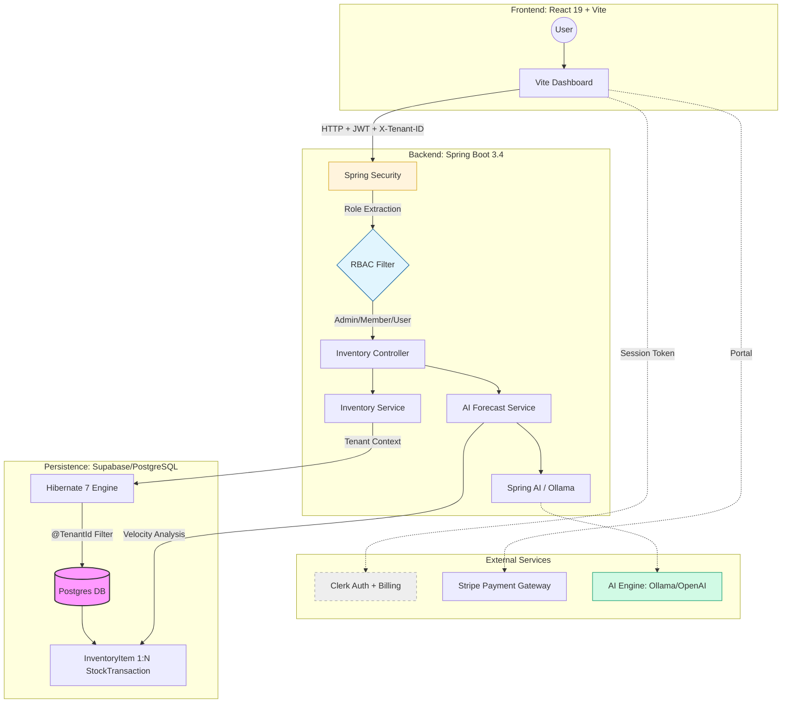

# 📦 stack-inventory-manager

An enterprise-grade, **Multi-tenant SaaS** platform for real-time inventory tracking. Architected with a high-performance **Spring Boot 3.4** core, a type-safe **React 19** frontend, and a **fully-automated AWS ecosystem** provisioned through **Terraform**.

> **Key Pillar:** Secure data isolation using Hibernate @TenantId, granular RBAC, and AI-Driven Forecasting—ensuring every stock movement is logged and enterprise insights are generated in real-time.

---

## System Architecture



## Tech Stack

### Frontend
* **Framework:** React 19+ (Vite)
* **Language:** TypeScript
* **Styling:** Tailwind CSS
* **Auth & Billing:** Clerk (Identity, Org Management & Stripe Native Billing)

### Backend (`saas-manager`)
* **Framework:** Spring Boot 3.4
* **AI Engine:** Integrated Analysis Service for stock forecasting and velocity tracking.
* **Language:** Java 21 (Amazon Corretto)
* **ORM:** Hibernate 7 (Native `@SoftDelete` & `@TenantId` support)
* **Reporting:** OpenPDF (Enterprise-grade PDF Engine)
* **Database:** Supabase (PostgreSQL) + H2 (Testing)
* **Security:** Spring Security + Method-level RBAC (`@PreAuthorize`)

### Infrastructure & DevOps
* **Cloud:** AWS (Region: `ap-southeast-1`)
* **Compute:** AWS App Runner
* **IaC:** Terraform
* **Containerization:** Docker (Multi-stage builds)

## Key Features

- **Multi-tenant Isolation:** Automatic data filtering via Hibernate `@TenantId` and the `X-Tenant-ID` header, ensuring users never see data from other organizations.
- **AI-Powered Inventory Insights:** Real-time stock forecasting that analyzes transaction history to predict "days-until-out" and generates reorder recommendations.
- **Native Billing System:** Integrated Clerk billing flow with **Subscription Guards**. Enterprise features like PDF reporting are dynamically gated based on the organization's plan.
- **Enterprise PDF Reporting:** Automated report generation using `OpenPDF`. Generates weekly snapshots including total valuation, SKU health, and low-stock alerts.
- **Robust Audit Trail:** Comprehensive tracking of every `STOCK_IN`, `STOCK_OUT`, and lifecycle event (`DELETED`). Uses **Native SQL Join** logic to maintain history visibility even after items are moved to the Recycle Bin.
- **Strict DTO Architecture:** 100% adherence to the DTO pattern in the Controller layer, ensuring total separation between the persistence layer and API contracts.
- **Dynamic Dashboard:** Real-time intelligence dashboard with health-ratio stats, live transaction feeds, and organization-level plan management.

## 🛠️ Local Development & Testing

### Prerequisites
- JDK 21+ (Amazon Corretto)
- Node.js 20+
- Docker

### Running Tests
To verify the multi-tenancy logic and security filters without connecting to your production DB:

```bash
cd saas-manager
mvn clean test
```
```bash
# Build & Push Backend
docker build -t saas-backend ./saas-manager
docker tag saas-backend:latest YOUR_ACCOUNT_ID.dkr.ecr.ap-southeast-1.amazonaws.com/saas-backend:latest
docker push YOUR_ACCOUNT_ID.dkr.ecr.ap-southeast-1.amazonaws.com/saas-backend:latest
```

---

## Why I Built This

I developed **stack-inventory-manager** to solve the complex architectural challenges inherent in modern SaaS environments.

### 1. The "SaaS First" Mentality
I implemented **Multi-tenancy at the database level**. This ensures that the platform can scale to support thousands of independent organizations while maintaining strict "siloed" security.

### 2. High-Consistency Architecture
In inventory management, a single desync in stock levels can ruin business operations. I built this using a **Transaction-first approach**, where every movement is backed by an immutable audit trail. I implemented native SQL joins to ensure that history is never "lost" when an item is deleted, bypassing Hibernate's default soft-delete filters for auditing.

### 3. Subscription-Driven Value
By integrating Stripe-native billing, I demonstrated how to bridge technical infrastructure with business logic—using custom metadata to gate high-resource features like PDF generation based on the tenant's current plan.

### 4. Predictive Intelligence
By integrating AI analysis, the platform shifts from a reactive tool (what do I have?) to a proactive partner (what will I run out of next week?).

---

## Architectural Decisions (Cost & Efficiency)

| Service | Choice | Why? (Cost & Logic) |
| :--- | :--- | :--- |
| **Compute** | **AWS App Runner** | Chosen over EKS/ECS to eliminate the "idle cost" of managing clusters. Scalable managed Fargate. |
| **Database** | **Supabase (PostgreSQL)** | High-performance hosted Postgres with built-in connection pooling. |
| **AI Analysis** | **OpenAI / LLM API** | Serverless inference prevents the massive overhead of hosting and GPU-scaling local ML models. |
| **Reporting** | **OpenPDF** | Lightweight, Java-native PDF generation that doesn't require external API overhead or per-request costs. |
| **Auth/Billing** | **Clerk** | Outsourcing Identity and Subscription management allowed me to focus on the core Inventory Logic. |
| **IaC** | **Terraform** | Automating the `ap-southeast-1` stack setup prevents manual config errors and "Cloud Waste." |

### 🛠️ The "Zero-Waste" Deployment Flow
By utilizing **Docker multi-stage builds**, the final production images are stripped of build-tools, resulting in tiny footprints. This reduces storage costs in ECR and speeds up deployment times.
