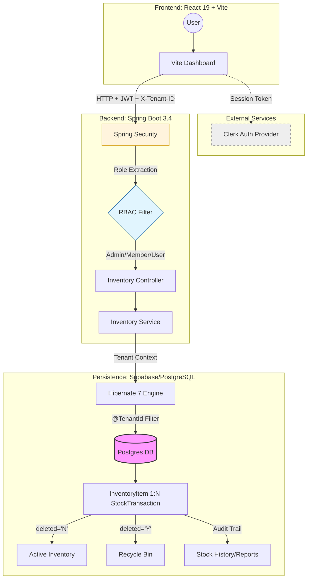

# 📦 stack-inventory-manager

An enterprise-grade, **Multi-tenant SaaS** platform for real-time inventory tracking. Architected with a high-performance **Spring Boot 3.4** core, a type-safe **React 19** frontend, and a **fully-automated AWS ecosystem** provisioned through **Terraform**.

> **Key Pillar:** Secure data isolation using Hibernate @TenantId, granular RBAC, and Complete Audit Traceability—ensuring every stock movement is logged, even for items currently in the Recycle Bin.

---

## System Architecture



## 🚀 Tech Stack

### Frontend
* **Framework:** React 19+ (Vite)
* **Language:** TypeScript
* **Styling:** Tailwind CSS
* **Auth:** Clerk (Identity & User Management)

### Backend (`saas-manager`)
* **Framework:** Spring Boot 3.4
* **Language:** Java 21 (Amazon Corretto)
* **ORM:** Hibernate 7 (Native `@SoftDelete` & `@TenantId` support)
* **Database:** Supabase (PostgreSQL) + H2 (Testing)
* **Security:** Spring Security + Method-level RBAC (`@PreAuthorize`)

### Infrastructure & DevOps
* **Cloud:** AWS (Region: `ap-southeast-1`)
* **Compute:** AWS App Runner
* **IaC:** Terraform
* **Containerization:** Docker (Multi-stage builds)

## Key Features

- **Multi-tenant Isolation:** Automatic data filtering via Hibernate `@TenantId` and the `X-Tenant-ID` header, ensuring users never see data from other organizations.
- **Automated Testing Suite:** 100% test coverage for multi-tenant isolation using H2 in-memory databases, catching tenant leaks during the build phase.
- **Granular RBAC:** Role-Based Access Control protecting endpoints for `ADMIN`, `MEMBER`, and `USER` roles.
- **Stock Movement & Audit Log:** Comprehensive tracking of every `STOCK_IN`, `STOCK_OUT`, and lifecycle event (`DELETED`/`RESTORED`). Includes a defensive history fetcher that maintains audit integrity even after items are soft-deleted.
- **Automated PDF Reporting:** Enterprise-level report generation using `OpenPDF`, featuring real-time inventory valuations, low-stock alerts, and recent activity summaries.
- **Strict DTO Pattern:** Total isolation between database entities and API responses for maximum security and flexibility.

## 🛠️ Local Development & Testing

### Prerequisites
- JDK 21+ (Amazon Corretto)
- Node.js 20+
- Docker

### Running Tests
To verify the multi-tenancy logic and security filters without connecting to your production DB:

```bash
cd saas-manager
mvn clean test
```
```bash
# Build & Push Backend
docker build -t saas-backend ./saas-manager
docker tag saas-backend:latest YOUR_ACCOUNT_ID.dkr.ecr.ap-southeast-1.amazonaws.com/saas-backend:latest
docker push YOUR_ACCOUNT_ID.dkr.ecr.ap-southeast-1.amazonaws.com/saas-backend:latest
```

## Why I Built This

I developed **stack-inventory-manager** to solve the complex architectural challenges inherent in modern SaaS environments.

### 1. The "SaaS First" Mentality
I implemented **Multi-tenancy at the database level**. This ensures that the platform can scale to support thousands of independent organizations while maintaining strict "siloed" security.

### 2. High-Consistency Architecture
In inventory management, a single desync in stock levels can ruin business operations. I built this using a **Transaction-first approach**, where every stock movement is backed by an audit trail. 

### 3. Test-Driven Reliability
Multi-tenant systems are high-risk. I implemented a robust integration testing layer that mocks JWT authentication and simulates cross-tenant attacks. By using Spring’s `@ActiveProfiles("test")`, the system switches to H2 during builds, ensuring logic changes never compromise data security.

## Architectural Decisions (Cost & Efficiency)

| Service | Choice | Why? (Cost & Logic) |
| :--- | :--- | :--- |
| **Compute** | **AWS App Runner** | Chosen over EKS/ECS to eliminate the "idle cost" of managing clusters. Scalable managed Fargate. |
| **Database** | **Supabase (PostgreSQL)** | High-performance hosted Postgres with a generous free tier. Built-in connection pooling. |
| **Testing DB** | **H2 (In-Memory)** | Zero-cost, high-speed isolation. Prevents "pollution" of the production database. |
| **Auth** | **Clerk** | Outsourcing Identity Management saved weeks of development time on MFA and session management. |
| **IaC** | **Terraform** | Automating the setup prevents "Cloud Waste" and allows for 1-click `terraform destroy`. |

### 🛠️ The "Zero-Waste" Deployment Flow
By utilizing **Docker multi-stage builds**, the final production images are stripped of build-tools, resulting in tiny footprints. This reduces storage costs in ECR and speeds up deployment times.
