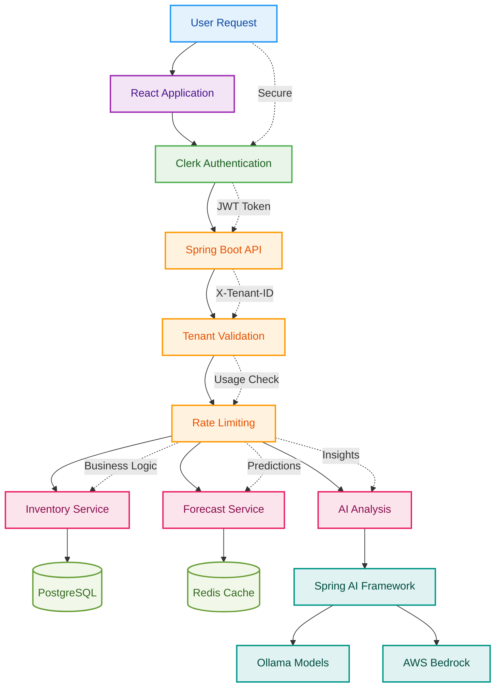

# SaaSManager

Enterprise-grade multi-tenant inventory management platform with advanced AI-powered insights, conversational interfaces, and real-time analytics.

A comprehensive B2B SaaS solution that provides complete data isolation, intelligent forecasting with conversation history, and scalable infrastructure for modern inventory management needs.

## Features

### Core Inventory Management
- Multi-tenant architecture with complete data isolation
- Product catalog management with full CRUD operations
- Real-time stock level tracking and monitoring
- Intelligent low stock alerts and threshold management
- Comprehensive stock adjustments and movement tracking
- Activity logging and complete audit trails

### AI-Powered Intelligence
- Advanced conversational AI chatbot with session persistence and conversation history
- Natural language inventory queries with intelligent intent classification
- AI-driven demand forecasting and predictive analytics with Spring AI framework
- Advanced stock velocity analysis and interactive visualizations using Recharts
- Automated inventory recommendations with entity extraction using OpenNLP
- Intent-based query processing system with multi-model AI support (Ollama + AWS Bedrock)

### Enterprise Security & Management
- Clerk-based authentication and authorization
- Role-based access control (Admin, Member, User)
- Organization-based multi-tenancy
- JWT token security with rate limiting
- Comprehensive usage tracking and analytics

### Analytics & Reporting
- Real-time dashboard with key performance metrics and IntelligenceHub integration
- Inventory valuation calculations and comprehensive analysis
- Interactive stock movement analytics with trend visualization using Recharts
- Advanced forecast visualization with AI-powered insights and recommendations
- Professional PDF report generation using OpenPDF (Pro feature)
- Activity feeds and real-time monitoring with automated alerts

### Cloud Infrastructure
- Docker containerization for consistency
- AWS App Runner for scalable deployment
- Terraform infrastructure as code
- High-performance PostgreSQL database
- Redis caching layer for optimal performance

## Architecture Overview


```mermaid
flowchart TD
    %% Define styles for better visual hierarchy
    classDef userStyle fill:#e3f2fd,stroke:#2196f3,stroke-width:2px,color:#0d47a1
    classDef frontendStyle fill:#f3e5f5,stroke:#9c27b0,stroke-width:2px,color:#4a148c
    classDef authStyle fill:#e8f5e8,stroke:#4caf50,stroke-width:2px,color:#1b5e20
    classDef apiStyle fill:#fff3e0,stroke:#ff9800,stroke-width:2px,color:#e65100
    classDef serviceStyle fill:#fce4ec,stroke:#e91e63,stroke-width:2px,color:#880e4f
    classDef dataStyle fill:#f1f8e9,stroke:#689f38,stroke-width:2px,color:#33691e
    classDef aiStyle fill:#e0f2f1,stroke:#009688,stroke-width:2px,color:#004d40

    %% User Request Flow
    User[User Request] --> Frontend[React Application]
    Frontend --> Auth[Clerk Authentication]
    Auth --> API[Spring Boot API]

    %% Security and Validation Layer
    API --> Tenant[Tenant Validation]
    Tenant --> Rate[Rate Limiting]

    %% Business Logic Layer
    Rate --> Inventory[Inventory Service]
    Rate --> Forecast[Forecast Service]
    Rate --> Analysis[AI Analysis]

    %% Data Storage Layer
    Inventory --> DB[(PostgreSQL)]
    Forecast --> Cache[(Redis Cache)]
    Analysis --> AI[ Spring AI Framework]

    %% AI Services Integration
    AI --> Ollama[ Ollama Models]
    AI --> Bedrock[ AWS Bedrock]

    %% Apply styles
    class User userStyle
    class Frontend frontendStyle
    class Auth authStyle
    class API,Tenant,Rate apiStyle
    class Inventory,Forecast,Analysis serviceStyle
    class DB,Cache dataStyle
    class AI,Ollama,Bedrock aiStyle

    %% Add flow annotations
    User:::userStyle -.->|Secure| Auth:::authStyle
    Auth:::authStyle -.->|JWT Token| API:::apiStyle
    API:::apiStyle -.->|X-Tenant-ID| Tenant:::apiStyle
    Tenant:::apiStyle -.->|Usage Check| Rate:::apiStyle
    Rate:::apiStyle -.->|Business Logic| Inventory:::serviceStyle
    Rate:::apiStyle -.->|Predictions| Forecast:::serviceStyle
    Rate:::apiStyle -.->|Insights| Analysis:::serviceStyle
```

### Technology Stack
- **Frontend:** React 18.2.0, TypeScript 5.9.3, Vite 7.2.4, TailwindCSS 4.1.18, Clerk Authentication
- **Backend:** Spring Boot 3.4.2, Java 21, Spring Security, Spring AI 1.0.0-M5
- **Database:** PostgreSQL for primary storage, Redis for caching and rate limiting
- **AI/ML:** Spring AI with Ollama and AWS Bedrock integration, Apache OpenNLP for entity extraction
- **Visualization:** Recharts 3.7.0 for interactive charts and analytics
- **Infrastructure:** AWS App Runner, ECR, Terraform, Docker
- **Testing:** Jest, TestContainers, Awaitility for comprehensive test coverage
- **Reporting:** OpenPDF for professional PDF generation

## Quick Start

### Prerequisites
- Node.js 18 or higher
- Java 21 Development Kit
- Docker and Docker Compose
- AWS CLI configured (for deployment)
- PostgreSQL and Redis instances

### Local Development Setup

1. **Clone the repository**
   ```bash
   git clone <repository-url>
   cd inventory-saas
   ```

2. **Start local dependencies**
   ```bash
   docker-compose up -d
   ```

3. **Configure environment variables**
   - Copy `.env.example` to `.env`
   - Configure database, authentication, and AI service credentials

4. **Start the backend**
   ```bash
   cd saas-manager
   ./mvnw spring-boot:run
   ```

5. **Start the frontend**
   ```bash
   cd frontend
   npm install
   npm run dev
   ```

6. **Access the application**
   - Frontend: http://localhost:5173
   - Backend API: http://localhost:8080

## Configuration

### Essential Environment Variables

#### Backend Configuration
```bash
# Database
DB_URL=jdbc:postgresql://localhost:5432/inventory_saas
DB_USERNAME=your_username
DB_PASSWORD=your_password

# Authentication
CLERK_ISSUER_URI=https://your-clerk-domain.com
CLERK_SECRET_KEY=your_clerk_secret_key

# Cache and Rate Limiting
REDIS_HOST=localhost
REDIS_PORT=6379
REDIS_PASSWORD=your_redis_password

# AI Services
SPRING_AI_BEDROCK_AWS_REGION=ap-southeast-1
AWS_REGION=ap-southeast-1
SPRING_AI_OLLAMA_BASE_URL=http://localhost:11434

# PDF Generation
# OpenPDF is automatically configured, no additional setup required
```

#### Frontend Configuration
```bash
# Clerk Authentication
VITE_CLERK_PUBLISHABLE_KEY=your_clerk_publishable_key

# API Configuration
VITE_API_BASE_URL=http://localhost:8080

# Redis (for rate limiting and caching)
VITE_UPSTASH_REDIS_REST_URL=your_redis_rest_url
VITE_UPSTASH_REDIS_REST_TOKEN=your_redis_rest_token

# Development Settings
VITE_DEV_MODE=true
VITE_DEBUG_AI_RESPONSES=false
```

## Deployment

### Local Development
For local development, use the provided Docker Compose configuration:
```bash
docker-compose up -d
```

This starts:
- Backend API service on port 8080 with Spring Boot application
- Frontend UI service on port 80 with Nginx reverse proxy
- PostgreSQL database and Redis cache (configured separately)
- Automatic service dependencies and health checks

### AWS Production Deployment

#### 1. Infrastructure Setup
```bash
cd terraform
terraform init
terraform apply
```

#### 2. Build and Deploy
```bash
# Deploy using automated script (supports dev branch deployment)
./deploy.sh
```

The deployment process:
1. Validates environment and builds Docker images for frontend and backend
2. Pushes images to Amazon ECR repositories with proper tagging
3. Provisions AWS App Runner services with Terraform
4. Configures environment variables, secrets, and networking
5. Sets up monitoring, logging, and health checks
6. Updates DNS and SSL certificates for production access

#### 3. Environment-Specific Configuration
- **Development:** Uses local PostgreSQL/Redis or dev branch deployment
- **Production:** Uses AWS RDS PostgreSQL and ElastiCache Redis
- **AI Services:** Configurable between Ollama (local) and AWS Bedrock (production)
- **Branch Strategy:** Dev branch deployment enabled for staging/testing

## Usage Guide

### Dashboard Navigation
The main dashboard provides:
- **Overview:** Real-time inventory metrics, key performance indicators, and IntelligenceHub with AI analysis
- **Forecast:** AI-powered demand predictions, trend analysis, and individual item forecasting

### Core Workflows

#### Inventory Management
1. **Add Products:** Use the inventory view to add new products with SKU, categories, and pricing
2. **Stock Adjustments:** Record stock movements with automatic audit trails
3. **Threshold Management:** Set minimum stock levels for automated alerts
4. **Activity Monitoring:** Track all inventory changes through comprehensive logs

#### AI-Powered Insights
1. **Conversational AI:** Interact with advanced chatbot featuring session persistence and conversation history
2. **Natural Language Queries:** Ask questions about inventory levels, forecasts, and trends with intelligent intent classification
3. **Demand Forecasting:** View AI-generated predictions for stock replenishment using Spring AI framework
4. **Velocity Analysis:** Understand product movement patterns with interactive Recharts visualizations
5. **Entity Extraction:** Leverage OpenNLP for automated inventory entity recognition and processing
6. **Recommendations:** Receive AI-driven suggestions for inventory optimization from multiple AI models

#### Multi-Tenant Operations
1. **Organization Management:** Switch between organizations seamlessly
2. **Role-Based Access:** Configure appropriate permissions for team members
3. **Usage Tracking:** Monitor API usage and stay within subscription limits
4. **Data Isolation:** Ensure complete separation of tenant data

## Development Guidelines

### Code Quality Standards
- Follow language-specific style guides (Java Code Conventions, ESLint rules)
- Maintain comprehensive test coverage using Jest, TestContainers, and Awaitility
- Use meaningful commit messages following conventional commit format
- Document complex business logic and architectural decisions
- Implement proper error handling and logging for AI service integrations

### Testing Requirements
- Unit tests for all service layer components with Jest and Spring Boot Test
- Integration tests for database operations using TestContainers
- End-to-end tests for critical user workflows and AI interactions
- Performance tests for AI service integrations and response times
- Multi-tenant data isolation testing with comprehensive coverage

## Troubleshooting

### Common Solutions

#### Database Connection Issues
- Verify PostgreSQL is running and accessible
- Check connection string and credentials
- Ensure database schema is properly initialized
- Review tenant isolation configuration

#### Authentication Setup Problems
- Verify Clerk configuration is correct
- Check JWT token validation settings
- Ensure proper CORS configuration
- Review organization and user permissions

#### AI Service Configuration Errors
- Confirm Ollama service is running and accessible (for local development)
- Verify AWS Bedrock credentials, permissions, and model availability
- Check Spring AI framework configuration and version compatibility
- Review OpenNLP entity extraction setup and model loading
- Monitor AI service response times and implement proper error handling
- Check conversation history persistence and session management

#### Frontend Build Issues
- Verify Node.js 18+ and npm dependencies are properly installed
- Check TypeScript configuration and compilation errors
- Review Vite build configuration and environment variables
- Ensure Clerk authentication keys are correctly configured
- Monitor Recharts integration and visualization performance

#### Deployment Troubleshooting
- Check AWS credentials and permissions
- Verify Terraform state is properly configured
- Review ECR repository permissions
- Ensure App Runner service health checks pass

### Performance Optimization
- Monitor Redis cache hit rates and optimize caching strategies for AI responses
- Review database query performance and implement proper indexing for tenant isolation
- Optimize AI service response times with Spring AI framework and model selection
- Track memory usage in App Runner services and implement proper scaling
- Optimize Recharts rendering performance for large datasets
- Monitor conversation history storage and implement efficient session management
- Implement proper rate limiting and usage tracking for multi-tenant environments

## License and Support

### License
This project is licensed under the MIT License. See the LICENSE file for details.

### Support Channels
- **Documentation:** Comprehensive guides and API references
- **Community:** GitHub Discussions for community support
- **Issues:** GitHub Issues for bug reports and feature requests
- **Enterprise:** Contact for enterprise support and custom implementations

### Contributing
We welcome contributions from the community. Please see the contributing guidelines for details on:
- Development workflow
- Code submission process
- Issue reporting procedures
- Community participation guidelines
